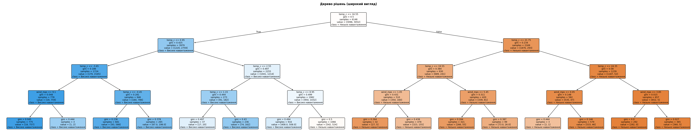
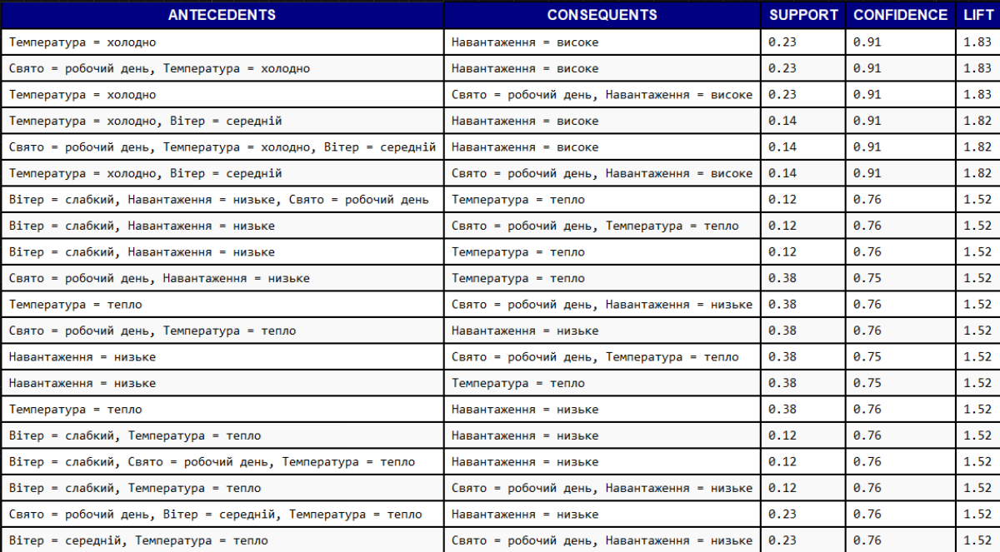
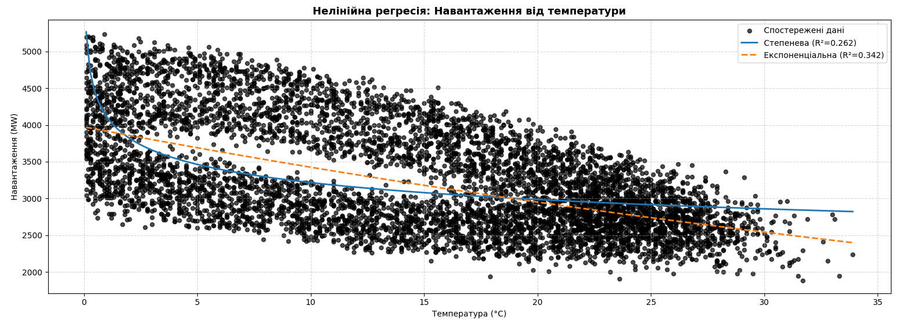

# ⚡ SmartCampus Data Mining

Навчальний застосунок для **інтелектуального аналізу даних (ІАД)**.  
Мета — дослідити залежність енергетичного навантаження від температури, вітру та календарних факторів за допомогою різних методів:  
- Дерево рішень  
- Асоціативні правила  
- Нелінійна регресія  

---

## 📂 Структура проєкту

- **power_load_hourly.csv** — вхідні дані (температура, навантаження, вітер, свята).  
- **decision_tree_ui.py** — вкладка «Дерево рішень» (класифікація навантаження, правила дерева, візуалізація).  
- **assoc_rules_ui.py** — вкладка «Асоціативні правила» (Apriori, ТОП‑20 правил, таблиця з прокруткою).  
- **nonlinear_ui.py** — вкладка «Нелінійна регресія» (степенева та експоненціальна моделі, графік + текстовий звіт).  
- **smartcampus_ui.py** — головний файл застосунку, що збирає всі вкладки в одне GUI.  

---

## 🚀 Як запустити

1. Клонувати репозиторій:
   ```bash
   git clone https://github.com/your-username/SmartCampus-DataMining.git
   cd SmartCampus-DataMining
   ```

2. Встановити залежності:
   ```bash
   pip install -r requirements.txt
   ```

3. Запустити головний файл:
   ```bash
   python smartcampus_ui.py
   ```

---

## 🧩 Функціонал

### 🌳 Дерево рішень
- Побудова дерева класифікації для прогнозу рівня навантаження.  
- Вивід правил у текстовому вигляді.  
- Візуалізація дерева з підписами вузлів.  

### 🔗 Асоціативні правила
- Дискретизація даних (температура, вітер, свято, навантаження).  
- Алгоритм **Apriori** для пошуку частих наборів.  
- Генерація правил з метриками `support`, `confidence`, `lift`.  
- Вивід ТОП‑20 правил у тексті та таблиці з прокруткою.  

### 📈 Нелінійна регресія
- Побудова **степеневої** та **експоненціальної** моделей.  
- Візуалізація даних та кривих апроксимації.  
- Текстовий звіт з формулами та коефіцієнтами детермінації R².  

---

## 📊 Використані методи

- **Decision Tree Classifier** (scikit-learn)  
- **Apriori + Association Rules** (mlxtend)  
- **Nonlinear Regression** (SciPy, NumPy)  
- **Matplotlib** для візуалізації  
- **Tkinter** для GUI  

---

## 🎯 Призначення

Цей застосунок демонструє різні підходи до аналізу даних:  
- класифікацію,  
- пошук прихованих правил,  
- апроксимацію залежностей.  

Він може бути використаний для:  
- навчання,  
- лабораторних робіт,  
- курсових/дипломних проєктів,  
- захисту з дисципліни **Інтелектуальний аналіз даних**.  

## 📌  Інтерфейс

- Вкладка **«Дерево рішень»**: дерево з правилами.  

- Вкладка **«Асоціативні правила»**: таблиця ТОП‑20 правил з прокруткою.  

- Вкладка **«Нелінійна регресія»**: графік з кривими та текстовий звіт.  

